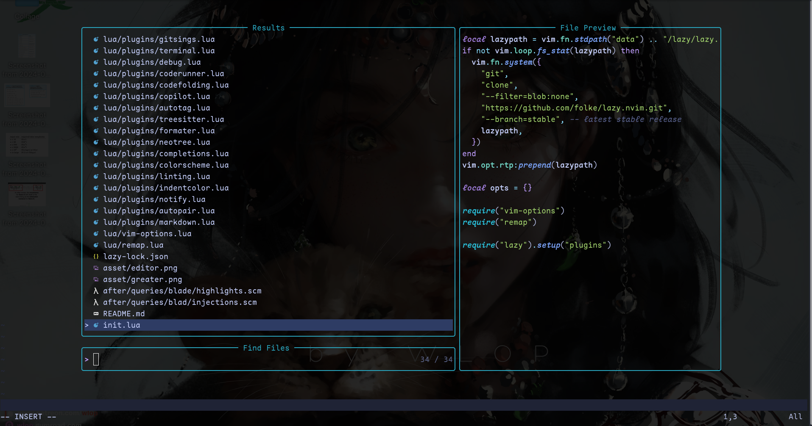
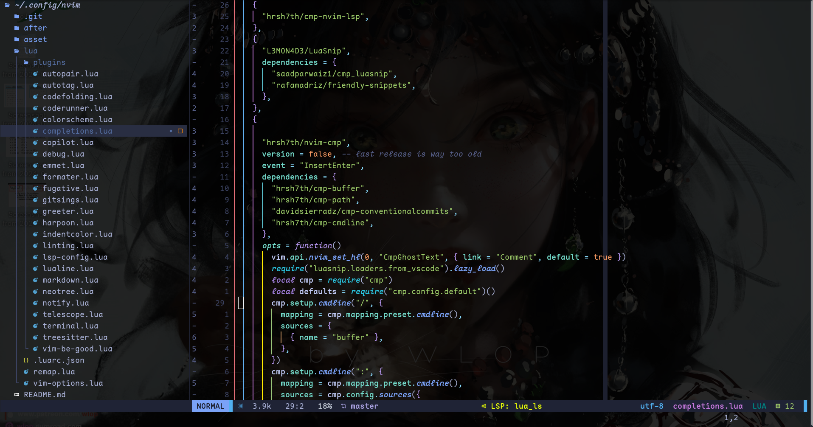

# Novim Personal

## installation
1. Download [Neovim](https://github.com/neovim/neovim/releases/download/v0.9.4/nvim.appimage) AppImage
2. Clone this repo
   ```shell
   git clone https://github.com/unedtamps/nvim-config.git ~/.config/nvim
   ```
3. Run nvim
   ```shell
   chmod +x nvim.appimage
   ```
   ```shell
    ./nvim.appimage .
   ```

   ## Pics
   

   

   
