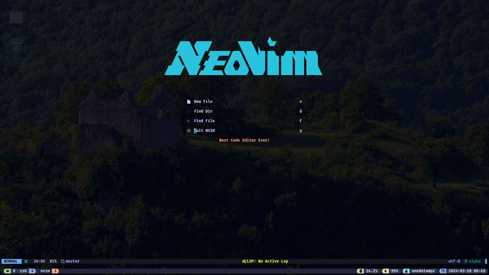
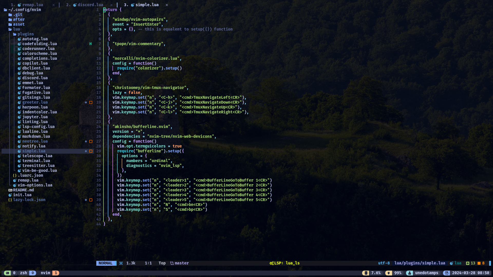
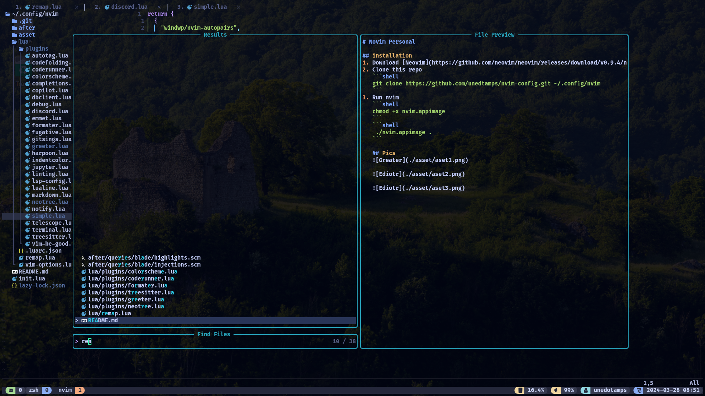

# Neovim Personal

## installation
1. Download [Neovim](https://github.com/neovim/neovim/releases/tag/v0.9.5) AppImage
2. Remove or backup your previous nvim config
   ```shell
   mv ~/.config/nvim ~/.config/nvim.backup
   ```
3. Clone this repo
   ```shell
   git clone https://github.com/unedtamps/nvim-config.git ~/.config/nvim
   ```
4. Install [Nerd Fonts](https://www.nerdfonts.com)

5. Run nvim
   ```shell
    chmod +x nvim.appimage && ./nvim.appimage
   ```

6. Install plugins

   Run this commnad in nvim after lazy vim finishes
    `:MasonInstallAll`


   ## Pics
   

   

   
